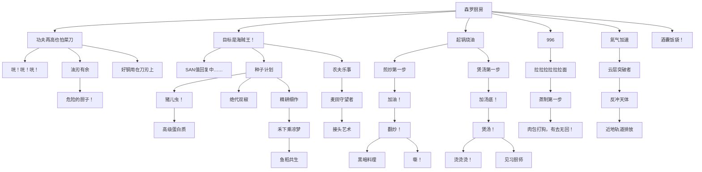

> 以下树状图根据 `KaleidoscopeCookery` 的 advancements 数据整理。
>
> 说明：这里列出的是 **模组主进度树**（`data/kaleidoscope_cookery/advancements/*.json`），**不包含** `advancements/recipes/` 下那批仅用于配方解锁的 recipe advancements。

## 主进度树

