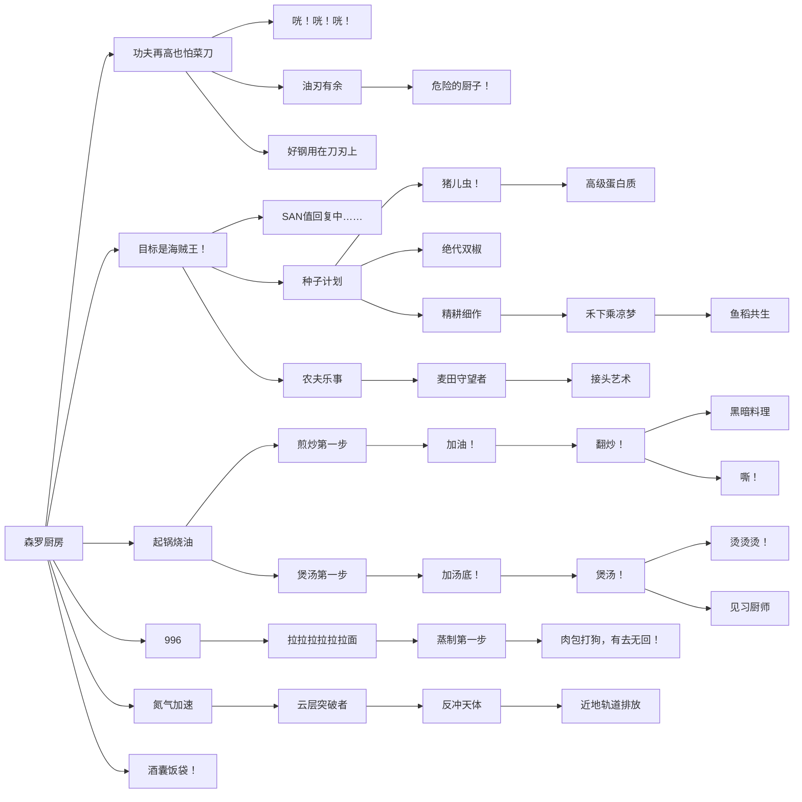

> 以下树状图根据 `KaleidoscopeCookery` 的 advancements 数据整理。
>
> 说明：这里列出的是 **模组主进度树**（`data/kaleidoscope_cookery/advancements/*.json`），**不包含** `advancements/recipes/` 下那批仅用于配方解锁的 recipe advancements。

## 进度图标说明

进度节点使用 Minecraft 风格的成就图标框，根据 `frame` 类型区分：

| 样式 | 类型 | 说明 |
| --- | --- | --- |
| <AdvancementIcon item="pot" frame="task" :size="36" /> | task | 普通进度 |
| <AdvancementIcon item="baozi" frame="goal" :size="36" /> | goal | 目标进度 |
| <AdvancementIcon item="oil" frame="challenge" :size="36" /> | challenge | 挑战进度 |

## 主进度树

```mermaid
graph LR
    root["森罗厨房"] --> iron_knife["功夫再高也怕菜刀"]
    root --> straw_hat["目标是海贼王！"]
    root --> stove["起锅烧油"]
    root --> millstone["996"]
    root --> nitrogen_100["氮气加速"]
    root --> transmutation_lunch_bag["酒囊饭袋！"]

    iron_knife --> chopping_board["咣！咣！咣！"]
    iron_knife --> oil["油刃有余"]
    iron_knife --> netherite_knife["好钢用在刀刃上"]
    oil --> dangerous_chef["危险的厨子！"]

    straw_hat --> flower_straw_hat["SAN值回复中……"]
    straw_hat --> tomato_seed["种子计划"]
    straw_hat --> farmer_set["农夫乐事"]
    tomato_seed --> caterpillar["猪儿虫！"]
    tomato_seed --> dual_chili["绝代双椒"]
    tomato_seed --> iron_hoe["精耕细作"]
    caterpillar --> feed_chicken["高级蛋白质"]
    iron_hoe --> rice_panicle["禾下乘凉梦"]
    rice_panicle --> fish_rice["鱼稻共生"]
    farmer_set --> scarecrow["麦田守望者"]
    scarecrow --> scarecrow_head["接头艺术"]

    stove --> pot["煎炒第一步"]
    stove --> stockpot["煲汤第一步"]
    pot --> add_oil["加油！"]
    add_oil --> stir_fry["翻炒！"]
    stir_fry --> dark_cuisine["黑暗料理"]
    stir_fry --> burn_hand["嘶！"]
    stockpot --> add_broth["加汤底！"]
    add_broth --> make_soup["煲汤！"]
    make_soup --> burn_hand_soup["烫烫烫！"]
    make_soup --> apprentice_chef["见习厨师"]

    millstone --> dough["拉拉拉拉拉拉面"]
    dough --> steamer["蒸制第一步"]
    steamer --> baozi["肉包打狗，有去无回！"]

    nitrogen_100 --> nitrogen_300["云层突破者"]
    nitrogen_300 --> nitrogen_1000["反冲天体"]
    nitrogen_1000 --> nitrogen_3000["近地轨道排放"]
```

## 图标对照表

| 图标 | 进度名称 | 描述 | 类型 |
| --- | --- | --- | --- |
| <AdvancementIcon item="pot" frame="task" :size="40" title="森罗厨房" /> | 森罗厨房 | 给世界添一丝奇幻色彩！ | task |
| <AdvancementIcon item="iron_kitchen_knife" frame="task" :size="40" title="功夫再高也怕菜刀" /> | 功夫再高也怕菜刀 | 获取第一把菜刀！ | task |
| <AdvancementIcon item="chopping_board" frame="task" :size="40" title="咣！咣！咣！" /> | 咣！咣！咣！ | 使用菜刀在菜板上制备新的食材 | task |
| <AdvancementIcon item="oil" frame="task" :size="40" title="油刃有余" /> | 油刃有余 | 使用菜刀击杀猪、猪灵、疣猪兽来获取油脂 | task |
| <AdvancementIcon item="oil" frame="challenge" :size="40" title="危险的厨子！" /> | 危险的厨子！ | 使用菜刀击杀猪灵蛮兵 | challenge |
| <AdvancementIcon item="netherite_kitchen_knife" frame="goal" :size="40" title="好钢用在刀刃上" /> | 好钢用在刀刃上 | 将菜刀升级至下界合金等级 | goal |
| <AdvancementIcon item="straw_hat" frame="task" :size="40" title="目标是海贼王！" /> | 目标是海贼王！ | 合成一个草帽 | task |
| <AdvancementIcon item="straw_hat_flower" frame="task" :size="40" title="SAN值回复中……" /> | SAN值回复中…… | 合成缀花草帽，它很好看，虽然没什么特别，但它真的很好看 | task |
| <AdvancementIcon item="tomato_seed" frame="task" :size="40" title="种子计划" /> | 种子计划 | 清理草丛时候请别忘记穿戴草帽，除了草籽，或许还有其他收获 | task |
| <AdvancementIcon item="caterpillar" frame="task" :size="40" title="猪儿虫！" /> | 猪儿虫！ | 总会在田间发现这些胖乎乎的家伙 | task |
| <AdvancementIcon item="caterpillar" frame="task" :size="40" title="高级蛋白质" /> | 高级蛋白质 | 使用猪儿虫喂小鸡 | task |
| <AdvancementIcon item="red_chili" frame="task" :size="40" title="绝代双椒" /> | 绝代双椒 | 收获到青辣椒和红辣椒！ | task |
| <AdvancementIcon item="iron_hoe" frame="task" :size="40" title="精耕细作" /> | 精耕细作 | 使用锄头在水中开垦水田，进行水稻插秧 | task |
| <AdvancementIcon item="rice_panicle" frame="task" :size="40" title="禾下乘凉梦" /> | 禾下乘凉梦 | 收获的季节，愈发怀念老先生…… | task |
| <AdvancementIcon item="salmon" frame="goal" :size="40" title="鱼稻共生" /> | 鱼稻共生 | 通过在水稻中养鱼来加速水稻生长速度！ | goal |
| <AdvancementIcon item="farmer_chest_plate" frame="task" :size="40" title="农夫乐事" /> | 农夫乐事 | 将农夫套装穿戴整齐，大幅提高在水中插秧的速度 | task |
| <AdvancementIcon item="scarecrow" frame="task" :size="40" title="麦田守望者" /> | 麦田守望者 | 使用稻草人来保护周围耕地 | task |
| <AdvancementIcon item="skeleton_skull" frame="task" :size="40" title="接头艺术" /> | 接头艺术 | 使用头颅来替换稻草人的南瓜头 | task |
| <AdvancementIcon item="stove" frame="task" :size="40" title="起锅烧油" /> | 起锅烧油 | 点燃一个炉灶，开始烹饪美食 | task |
| <AdvancementIcon item="pot" frame="task" :size="40" title="煎炒第一步" /> | 煎炒第一步 | 合成炒锅，将它放在炉灶、营火等热源上方加热 | task |
| <AdvancementIcon item="oil" frame="task" :size="40" title="加油！" /> | 加油！ | 将油脂加入炒锅，当然也可以使用锅铲从搪瓷盆子挖一勺油脂加入锅里，开始烹饪！ | task |
| <AdvancementIcon item="kitchen_shovel" frame="task" :size="40" title="翻炒！" /> | 翻炒！ | 加入食材后使用锅铲进行不断翻炒，当食材炒熟后使用碗来盛出！ | task |
| <AdvancementIcon item="suspicious_stir_fry_rice_bowl" frame="task" :size="40" title="黑暗料理" /> | 黑暗料理 | 厨艺有待进步…… | task |
| <AdvancementIcon item="flint_and_steel" frame="task" :size="40" title="嘶！" /> | 嘶！ | 炒锅不会容忍你加错了食材，并给予从锅里拿回食材的你一点惩罚 | task |
| <AdvancementIcon item="stockpot" frame="task" :size="40" title="煲汤第一步" /> | 煲汤第一步 | 合成汤锅，将它放在炉灶、营火等热源上方加热 | task |
| <AdvancementIcon item="lava_bucket" frame="task" :size="40" title="加汤底！" /> | 加汤底！ | 制作不同风味的汤首先需要加入不同的汤底！ | task |
| <AdvancementIcon item="stockpot_lid" frame="task" :size="40" title="煲汤！" /> | 煲汤！ | 向锅里添加完食材后盖上锅盖进行煲汤，掀开盖子汤煲好后使用碗来盛出！ | task |
| <AdvancementIcon item="flint_and_steel" frame="task" :size="40" title="烫烫烫！" /> | 烫烫烫！ | 加了熔岩汤底的汤锅不会容忍你加错了食材，并给予从锅里拿回食材的你一点惩罚 | task |
| <AdvancementIcon item="borscht" frame="goal" :size="40" title="见习厨师" /> | 见习厨师 | 获取一碗罗宋汤 | goal |
| <AdvancementIcon item="millstone" frame="task" :size="40" title="996" /> | 996 | 骑着驴到磨盘上驱动磨盘 | task |
| <AdvancementIcon item="raw_dough" frame="task" :size="40" title="拉拉拉拉拉拉面" /> | 拉拉拉拉拉拉面 | 将面团拉扯成面条 | task |
| <AdvancementIcon item="steamer" frame="task" :size="40" title="蒸制第一步" /> | 蒸制第一步 | 将蒸笼放置在热源上蒸制食物 | task |
| <AdvancementIcon item="baozi" frame="goal" :size="40" title="肉包打狗，有去无回！" /> | 肉包打狗，有去无回！ | 潜行并抛出一个蒸包击中狼，使其回血 | goal |
| <AdvancementIcon item="feather" frame="goal" :size="40" title="氮气加速" /> | 氮气加速 | 在获得胀气效果的情况下爬升 100 格高度 | goal |
| <AdvancementIcon item="feather" frame="goal" :size="40" title="云层突破者" /> | 云层突破者 | 在获得胀气效果的情况下爬升 300 格高度 | goal |
| <AdvancementIcon item="feather" frame="goal" :size="40" title="反冲天体" /> | 反冲天体 | 在获得胀气效果的情况下爬升 1000 格高度 | goal |
| <AdvancementIcon item="feather" frame="challenge" :size="40" title="近地轨道排放" /> | 近地轨道排放 | 在获得胀气效果的情况下爬升 3000 格高度 | challenge |
| <AdvancementIcon item="transmutation_lunch_bag" frame="goal" :size="40" title="酒囊饭袋！" /> | 酒囊饭袋！ | 使用嬗变饭袋进食 | goal |
