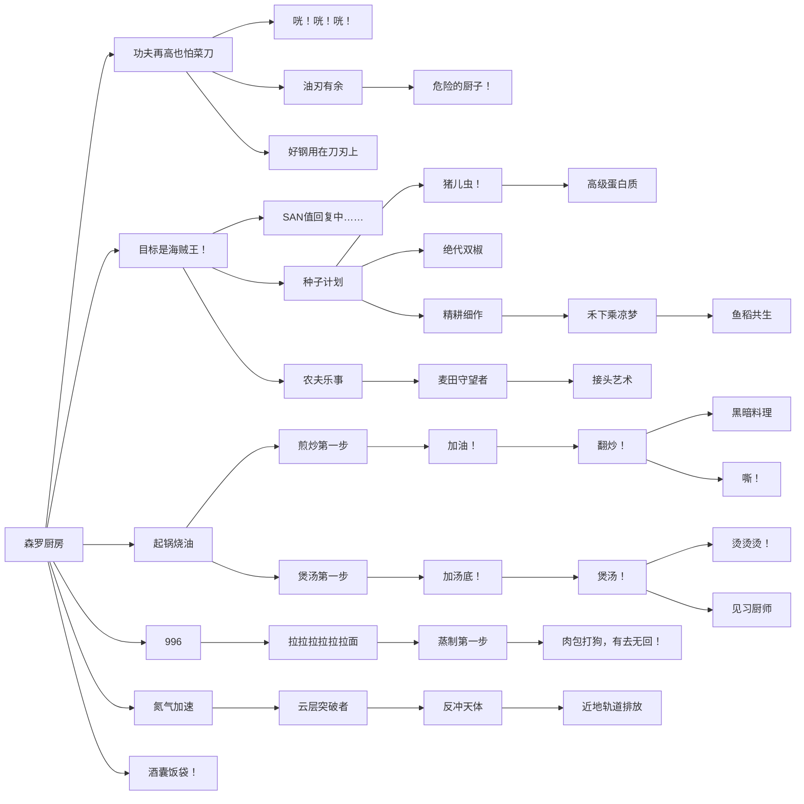

> 以下树状图根据 `KaleidoscopeCookery` 的 advancements 数据整理。
>
> 说明：这里列出的是 **模组主进度树**（`data/kaleidoscope_cookery/advancements/*.json`），**不包含** `advancements/recipes/` 下那批仅用于配方解锁的 recipe advancements。

## 进度图标说明

进度节点使用 Minecraft 风格的成就图标框，根据 `frame` 类型区分：

| 样式 | 类型 | 说明 |
| --- | --- | --- |
| <AdvancementIcon item="pot" frame="task" :size="36" /> | task | 普通进度 |
| <AdvancementIcon item="baozi" frame="goal" :size="36" /> | goal | 目标进度 |
| <AdvancementIcon item="oil" frame="challenge" :size="36" /> | challenge | 挑战进度 |

## 主进度树

```mermaid
graph LR
    root["森罗厨房"] --> iron_knife["功夫再高也怕菜刀"]
    root --> straw_hat["目标是海贼王！"]
    root --> stove["起锅烧油"]
    root --> millstone["996"]
    root --> nitrogen_100["氮气加速"]
    root --> transmutation_lunch_bag["酒囊饭袋！"]

    iron_knife --> chopping_board["咣！咣！咣！"]
    iron_knife --> oil["油刃有余"]
    iron_knife --> netherite_knife["好钢用在刀刃上"]
    oil --> dangerous_chef["危险的厨子！"]

    straw_hat --> flower_straw_hat["SAN值回复中……"]
    straw_hat --> tomato_seed["种子计划"]
    straw_hat --> farmer_set["农夫乐事"]
    tomato_seed --> caterpillar["猪儿虫！"]
    tomato_seed --> dual_chili["绝代双椒"]
    tomato_seed --> iron_hoe["精耕细作"]
    caterpillar --> feed_chicken["高级蛋白质"]
    iron_hoe --> rice_panicle["禾下乘凉梦"]
    rice_panicle --> fish_rice["鱼稻共生"]
    farmer_set --> scarecrow["麦田守望者"]
    scarecrow --> scarecrow_head["接头艺术"]

    stove --> pot["煎炒第一步"]
    stove --> stockpot["煲汤第一步"]
    pot --> add_oil["加油！"]
    add_oil --> stir_fry["翻炒！"]
    stir_fry --> dark_cuisine["黑暗料理"]
    stir_fry --> burn_hand["嘶！"]
    stockpot --> add_broth["加汤底！"]
    add_broth --> make_soup["煲汤！"]
    make_soup --> burn_hand_soup["烫烫烫！"]
    make_soup --> apprentice_chef["见习厨师"]

    millstone --> dough["拉拉拉拉拉拉面"]
    dough --> steamer["蒸制第一步"]
    steamer --> baozi["肉包打狗，有去无回！"]

    nitrogen_100 --> nitrogen_300["云层突破者"]
    nitrogen_300 --> nitrogen_1000["反冲天体"]
    nitrogen_1000 --> nitrogen_3000["近地轨道排放"]
```

## 图标对照表

| 图标 | 进度名称 | 类型 |
| --- | --- | --- |
| <AdvancementIcon item="pot" frame="task" :size="40" title="森罗厨房" /> | 森罗厨房 | task |
| <AdvancementIcon item="iron_kitchen_knife" frame="task" :size="40" title="功夫再高也怕菜刀" /> | 功夫再高也怕菜刀 | task |
| <AdvancementIcon item="chopping_board" frame="task" :size="40" title="咣！咣！咣！" /> | 咣！咣！咣！ | task |
| <AdvancementIcon item="oil" frame="task" :size="40" title="油刃有余" /> | 油刃有余 | task |
| <AdvancementIcon item="oil" frame="challenge" :size="40" title="危险的厨子！" /> | 危险的厨子！ | challenge |
| <AdvancementIcon item="netherite_kitchen_knife" frame="goal" :size="40" title="好钢用在刀刃上" /> | 好钢用在刀刃上 | goal |
| <AdvancementIcon item="straw_hat" frame="task" :size="40" title="目标是海贼王！" /> | 目标是海贼王！ | task |
| <AdvancementIcon item="straw_hat_flower" frame="task" :size="40" title="SAN值回复中……" /> | SAN值回复中…… | task |
| <AdvancementIcon item="tomato_seed" frame="task" :size="40" title="种子计划" /> | 种子计划 | task |
| <AdvancementIcon item="caterpillar" frame="task" :size="40" title="猪儿虫！" /> | 猪儿虫！ | task |
| <AdvancementIcon item="caterpillar" frame="task" :size="40" title="高级蛋白质" /> | 高级蛋白质 | task |
| <AdvancementIcon item="red_chili" frame="task" :size="40" title="绝代双椒" /> | 绝代双椒 | task |
| <AdvancementIcon item="iron_hoe" frame="task" :size="40" title="精耕细作" /> | 精耕细作 | task |
| <AdvancementIcon item="rice_panicle" frame="task" :size="40" title="禾下乘凉梦" /> | 禾下乘凉梦 | task |
| <AdvancementIcon item="salmon" frame="goal" :size="40" title="鱼稻共生" /> | 鱼稻共生 | goal |
| <AdvancementIcon item="farmer_chest_plate" frame="task" :size="40" title="农夫乐事" /> | 农夫乐事 | task |
| <AdvancementIcon item="scarecrow" frame="task" :size="40" title="麦田守望者" /> | 麦田守望者 | task |
| <AdvancementIcon item="skeleton_skull" frame="task" :size="40" title="接头艺术" /> | 接头艺术 | task |
| <AdvancementIcon item="stove" frame="task" :size="40" title="起锅烧油" /> | 起锅烧油 | task |
| <AdvancementIcon item="pot" frame="task" :size="40" title="煎炒第一步" /> | 煎炒第一步 | task |
| <AdvancementIcon item="oil" frame="task" :size="40" title="加油！" /> | 加油！ | task |
| <AdvancementIcon item="kitchen_shovel" frame="task" :size="40" title="翻炒！" /> | 翻炒！ | task |
| <AdvancementIcon item="suspicious_stir_fry_rice_bowl" frame="task" :size="40" title="黑暗料理" /> | 黑暗料理 | task |
| <AdvancementIcon item="flint_and_steel" frame="task" :size="40" title="嘶！" /> | 嘶！ | task |
| <AdvancementIcon item="stockpot" frame="task" :size="40" title="煲汤第一步" /> | 煲汤第一步 | task |
| <AdvancementIcon item="lava_bucket" frame="task" :size="40" title="加汤底！" /> | 加汤底！ | task |
| <AdvancementIcon item="stockpot_lid" frame="task" :size="40" title="煲汤！" /> | 煲汤！ | task |
| <AdvancementIcon item="flint_and_steel" frame="task" :size="40" title="烫烫烫！" /> | 烫烫烫！ | task |
| <AdvancementIcon item="borscht" frame="goal" :size="40" title="见习厨师" /> | 见习厨师 | goal |
| <AdvancementIcon item="millstone" frame="task" :size="40" title="996" /> | 996 | task |
| <AdvancementIcon item="raw_dough" frame="task" :size="40" title="拉拉拉拉拉拉面" /> | 拉拉拉拉拉拉面 | task |
| <AdvancementIcon item="steamer" frame="task" :size="40" title="蒸制第一步" /> | 蒸制第一步 | task |
| <AdvancementIcon item="baozi" frame="goal" :size="40" title="肉包打狗，有去无回！" /> | 肉包打狗，有去无回！ | goal |
| <AdvancementIcon item="feather" frame="goal" :size="40" title="氮气加速" /> | 氮气加速 | goal |
| <AdvancementIcon item="feather" frame="goal" :size="40" title="云层突破者" /> | 云层突破者 | goal |
| <AdvancementIcon item="feather" frame="goal" :size="40" title="反冲天体" /> | 反冲天体 | goal |
| <AdvancementIcon item="feather" frame="challenge" :size="40" title="近地轨道排放" /> | 近地轨道排放 | challenge |
| <AdvancementIcon item="transmutation_lunch_bag" frame="goal" :size="40" title="酒囊饭袋！" /> | 酒囊饭袋！ | goal |
