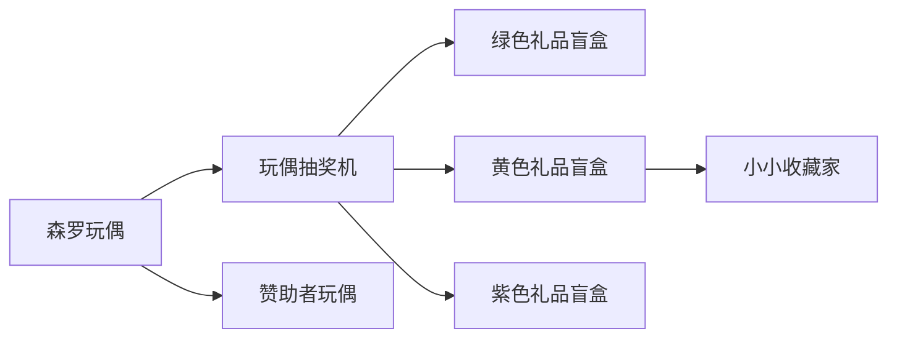

> 以下内容根据 `KaleidoscopeDoll` 的 advancements 数据整理。全部进度共享同一张“森罗玩偶”背景，均不会隐藏。

## 进度图标说明

进度节点使用 Minecraft 风格的成就图标框，根据 `frame` 类型区分：

| 样式 | 类型 | 说明 |
| --- | --- | --- |
| <AdvancementIcon item="kaleidoscope_doll:doll_52" frame="task" :size="36" /> | task | 普通进度 |
| <AdvancementIcon item="kaleidoscope_doll:doll_5" frame="challenge" :size="36" /> | challenge | 挑战进度 |

## 主进度树

## 图标对照表

| 图标 | 进度名称 | 描述 | 类型 |
| --- | --- | --- | --- |
| <AdvancementIcon item="kaleidoscope_doll:doll_52" frame="task" :size="40" title="森罗玩偶" /> | 森罗玩偶 | 给世界添一抹奇幻色彩！ | task |
| <AdvancementIcon item="kaleidoscope_doll:doll_machine" frame="task" :size="40" title="玩偶抽奖机" /> | 玩偶抽奖机 | 使用铁锭，金锭或者钻石代币抽奖！ | task |
| <AdvancementIcon item="kaleidoscope_doll:green_doll_gift_box" frame="task" :size="40" title="绿色礼品盲盒" /> | 绿色礼品盲盒 | 主世界盲盒 | task |
| <AdvancementIcon item="kaleidoscope_doll:yellow_doll_gift_box" frame="task" :size="40" title="黄色礼品盲盒" /> | 黄色礼品盲盒 | 下界盲盒 | task |
| <AdvancementIcon item="kaleidoscope_doll:purple_doll_gift_box" frame="task" :size="40" title="紫色礼品盲盒" /> | 紫色礼品盲盒 | 末地盲盒 | task |
| <AdvancementIcon item="kaleidoscope_doll:doll_5" frame="challenge" :size="40" title="小小收藏家" /> | 小小收藏家 | 获得全部种类的原版玩偶 | challenge |
| <AdvancementIcon item="kaleidoscope_doll:doll_0" frame="task" :size="40" title="赞助者玩偶" /> | 赞助者玩偶 | 通过电脑获取玩偶 | task |

## 完成条件

| 进度 | 解锁方式 |
| --- | --- |
| 森罗玩偶 | 进入游戏即解锁（根进度） |
| 玩偶抽奖机 | 物品栏中拥有玩偶抽奖机 |
| 绿色 / 黄色 / 紫色礼品盲盒 | 物品栏中拥有对应颜色的礼品盲盒 |
| 小小收藏家 | 收集全部 **71 种**原版玩偶（`doll_2`～`doll_66` 与 `doll_326`～`doll_329`、`doll_690`、`doll_691`），奖励 **100 经验** |
| 赞助者玩偶 | 进入游戏即解锁（展示用进度），提示玩家通过电脑获取玩偶 |

::: tip 与抽奖机的对应
三种盲盒进度都以“玩偶抽奖机”为前置：想点亮整条抽奖线，先用铁锭、金锭、钻石各抽一次即可。
:::

原版玩偶的完整清单见[玩偶图鉴](/wiki/doll/collection/)，抽奖规则见[玩偶抽奖机](/wiki/doll/machine/)。
